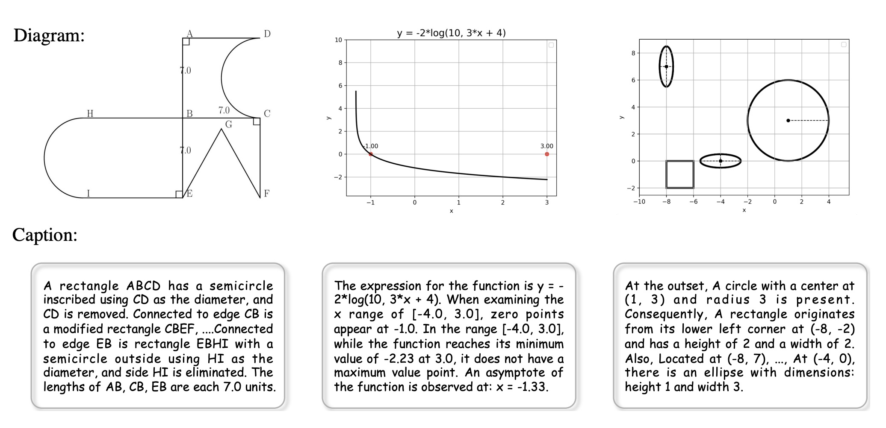
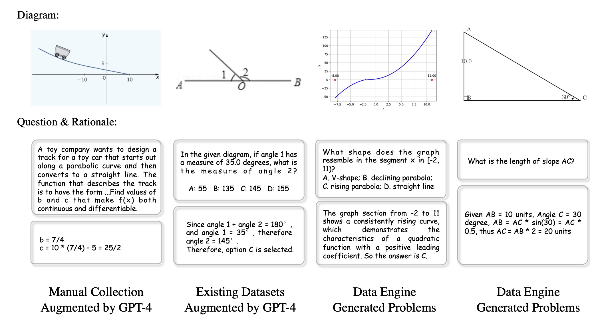
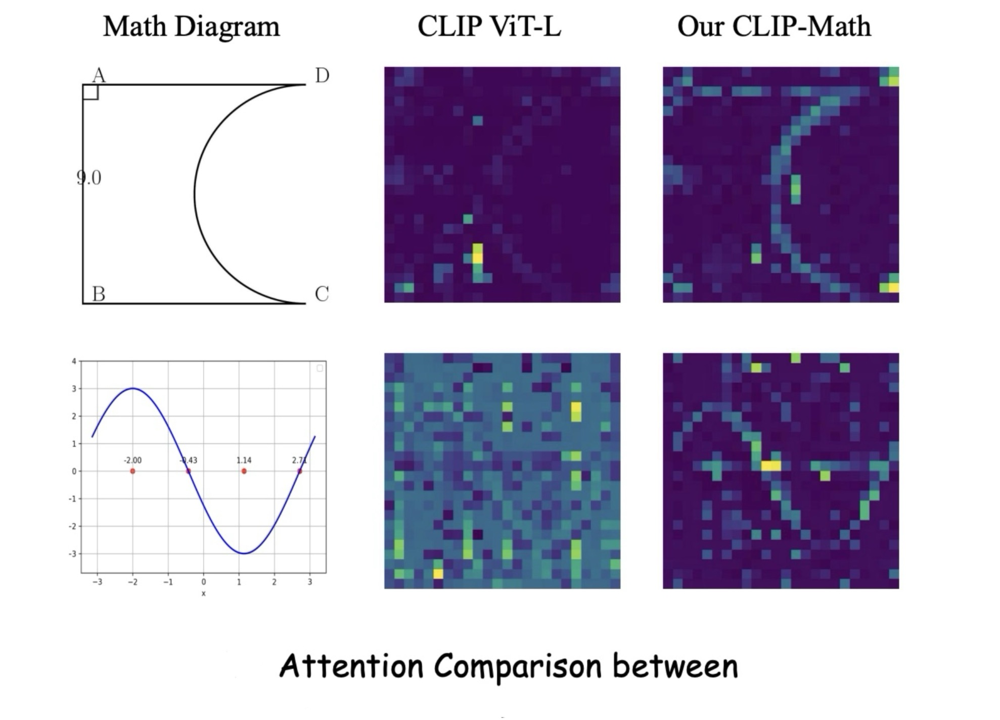
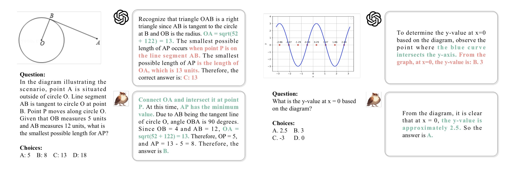

# MAVIS 🔥: Mathematical Visual Instruction Tuning

 
 
 


Official repository for the paper "[MAVIS: Mathematical Visual Instruction Tuning](https://arxiv.org/pdf/2407.08739)".

[[📖 Paper](https://arxiv.org/pdf/2407.08739)] [[🤗 MAVIS-Caption](https://huggingface.co/datasets/MAVIS-MATH/MAVIS-Caption)] [[🤗 MAVIS-Instruct](https://huggingface.co/datasets/MAVIS-MATH/MAVIS-Instruct)] [[🏆 Leaderboard](https://mathverse-cuhk.github.io/#leaderboard)]

🌟 Our model is mainly evaluation on [MathVerse](https://mathverse-cuhk.github.io/), a comprehensive visual mathematical benchmark for MLLMs

## 💥 News

- **[2024.07.11]** 🚀 We release **MAVIS** to facilitate MLLM's visual mathematical capabilities 📐
- **[2024.07.01]** 🎉 MathVerse is accepted by ECCV 2024 🎉
- **[2024.03.22]** 🔥 We release the **MathVerse benchmark** ([🌐 Webpage](https://mathverse-cuhk.github.io/), [📑 Paper](https://arxiv.org/pdf/2403.14624), and [🤗 Dataset](https://huggingface.co/datasets/AI4Math/MathVerse))

## 📌 ToDo

- Coming soon: dataset and models

## 👀 About MAVIS

  We identify three key areas within **Multi-modal Large Language Models (MLLMs)** for **visual math problem-solving** that need to be improved: *visual encoding of math diagrams*, *diagram-language alignment*, and *mathematical reasoning skills*.
  
  In this paper, we propose **MAVIS**, the first **MA**thematical **VIS**ual instruction tuning paradigm for MLLMs, including two newly curated datasets, a mathematical vision encoder, and a mathematical MLLM:
- **MAVIS-Caption**: ***588K*** high-quality caption-diagram pairs, spanning geometry and function

<p align="center">
     <br>
</p>

- **MAVIS-Instruct**: ***834K*** instruction-tuning data with CoT rationales in a text-lite version
  
<p align="center">
     <br>
</p>

- **Math-CLIP**: a vision encoder specifically for understanding mathematical diagrams within MLLMs

<p align="center">
     <br>
</p>

- **MAVIS-7B**: an MLLM with a three-stage training paradigm achiving leading performance on MathVerse benchmark

 <p align="center">
     <br>
</p>

## 💪 Get Started
Coming in a week!
### Data Usage
### Training
### Inference


## :white_check_mark: Citation

If you find **MAVIS** useful for your research and applications, please kindly cite using this BibTeX:

```latex
@misc{zhang2024mavismathematicalvisualinstruction,
      title={MAVIS: Mathematical Visual Instruction Tuning}, 
      author={Renrui Zhang and Xinyu Wei and Dongzhi Jiang and Yichi Zhang and Ziyu Guo and Chengzhuo Tong and Jiaming Liu and Aojun Zhou and Bin Wei and Shanghang Zhang and Peng Gao and Hongsheng Li},
      year={2024},
      eprint={2407.08739},
      archivePrefix={arXiv},
      primaryClass={cs.CV},
      url={https://arxiv.org/abs/2407.08739}, 
}
```

## 🧠 Related Work

Explore our additional research on **Vision-Language Large Models**, focusing on multi-modal LLMs and mathematical reasoning:

- **[MathVerse]** [MathVerse: Does Your Multi-modal LLM Truly See the Diagrams in Visual Math Problems?](https://mathverse-cuhk.github.io/)
- **[LLaVA-NeXT-Interleave]** [Tackling Multi-image, Video, and 3D in Large Multimodal Models](https://llava-vl.github.io/blog/2024-06-16-llava-next-interleave/)
- **[MathVista]** [MathVista: Evaluating Mathematical Reasoning of Foundation Models in Visual Contexts](https://github.com/lupantech/MathVista)
- **[LLaMA-Adapter]** [LLaMA-Adapter: Efficient Fine-tuning of Language Models with Zero-init Attention](https://github.com/OpenGVLab/LLaMA-Adapter)
- **[ImageBind-LLM]** [Imagebind-LLM: Multi-modality Instruction Tuning](https://github.com/OpenGVLab/LLaMA-Adapter/tree/main/imagebind_LLM)
- **[SPHINX-X]** [Scaling Data and Parameters for a Family of Multi-modal Large Language Models](https://github.com/Alpha-VLLM/LLaMA2-Accessory/tree/main/SPHINX)
- **[Point-Bind & Point-LLM]** [Multi-modality 3D Understanding, Generation, and Instruction Following](https://github.com/ZiyuGuo99/Point-Bind_Point-LLM)
- **[PerSAM]** [Personalize segment anything model with one shot](https://github.com/ZrrSkywalker/Personalize-SAM)
- **[MathCoder]** [MathCoder: Seamless Code Integration in LLMs for Enhanced Mathematical Reasoning](https://github.com/mathllm/MathCoder)
- **[MathVision]** [Measuring Multimodal Mathematical Reasoning with the MATH-Vision Dataset](https://github.com/mathvision-cuhk/MathVision)
- **[CSV]** [Solving Challenging Math Word Problems Using GPT-4 Code Interpreter](https://wangk.org/publications/1_iclr2024_csv/)
